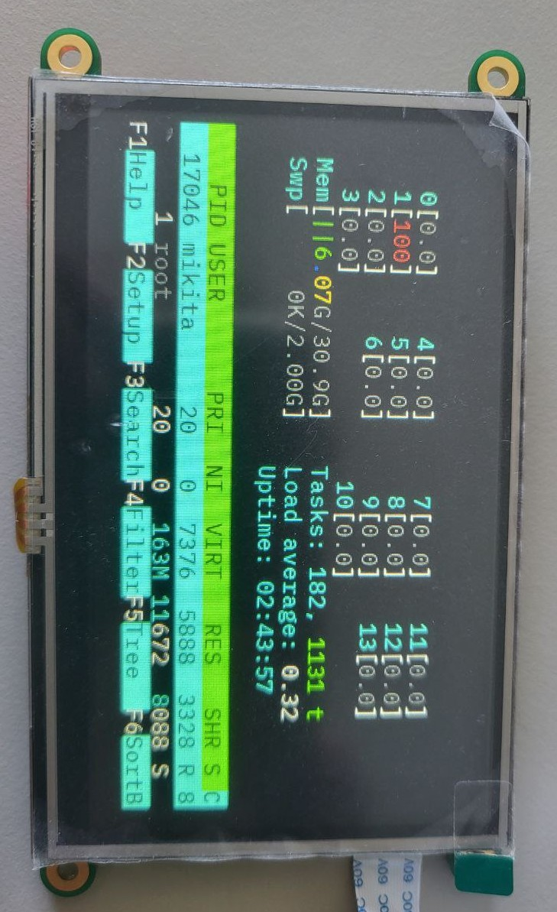

# EVE Controller Command Guide

## Overview

This guide provides commands for interacting with the EVE controller to display terminal text and manage by ANSI commands the screen from Linux.



---

## Precondition

### Installing libftdi and libusb

For Debian/Ubuntu:
```bash
sudo apt install libftdi1-dev
sudo apt install libusb-1.0-0-dev
```
For Arch Linux (or Manjaro):
```bash
sudo pacman -S libftdi
sudo pacman -S libusb
```

For Fedora:
```bash
sudo dnf install libftdi-devel
sudo dnf install libusb1-devel
```

---

### Installation

#### In folder need to be: 

``` bash
> eveld_43_480x272_EVE3_TPC
> install.sh
> uninstall.sh
```

Download installer:

``` bash
curl -L -o install.sh https://github.com/TsybukloN/EVE-project/releases/latest/download/install.sh
```

Run the installation script:

``` bash
sudo bash install.sh
```

#### The installer performs 4 tasks:

- Dowload binary file from latest Github release if does not find it in directory.
- Place the binary file in the `/usr/local/bin` directory.
- Create a service `eveld` that runs `/usr/local/bin/eveld_43_480x272_EVE3_TPC`.
- Create a udev rule in `/etc/udev/rules.d/99-eve.rules` to restart the `eveld` service when the monitor is plugged in.

### Update

Delete previous binary file:

```bash
rm -rf eveld_43_480x272_EVE3_TPC
```

Run the installation script:

``` bash
sudo bash install.sh
```

New binary pull up from latest GitHub Release.

### Uninstallation

Download installer:

``` bash
curl -L -o install.sh https://github.com/TsybulkaM/EVE-project/releases/download/v1.0.1/install.sh
```

Run the installation script:

``` bash
sudo bash install.sh
```


## Commands

### Realised 

```bash
TERM=linux stty cols 46 rows 14; top | cat -v > /tmp/eve_pipe
```

### Known Issues

The following commands execute but may not work as expected:

```bash
TERM=linux stty cols 47 rows 13; htop | cat -v > /tmp/eve_pipe
```

### Clear Screen 
To clear the screen:
```bash
clear | cat -v > /tmp/eve_pipe
```

### Test commands

#### Text

## Change Font

```bash
echo -ne "\e]50;IBM_Plex_Mono-16\a" | cat -v > /tmp/eve_pipe
echo -ne "\e]50;IBM_Plex_Mono-20\a" | cat -v > /tmp/eve_pipe
echo -ne "\e]50;IBM_Plex_Mono-26\a" | cat -v > /tmp/eve_pipe
```

```bash
echo "AC/DC" | cat -v > /tmp/eve_pipe
```

```bash
echo {A..Z} | tr -d ' ' > /tmp/eve_pipe
```

```bash
echo {a..z} | tr -d ' ' > /tmp/eve_pipe
```

#### Formated Text

```bash
echo -e "\e[31mRed\e[mStandart." | cat -v > /tmp/eve_pipe
```

```bash
echo -e "\e[31mПоддержка\e[m текста" | cat -v > /tmp/eve_pipe
```

```bash
echo "Hello, Eve!" | pv -qL 10 | cat -v > /tmp/eve_pipe
echo "Hello, Eve!" | cat -v > /tmp/eve_pipe
```
This will print "Hello, World!" with delay.

```bash
cowsay "Hello, Eve!" | lolcat | cat -v > /tmp/eve_pipe
```
Cowsay ASCII-art

#### System commands 

```bash
TERM=linux stty cols 55 rows 11; df -h | cat -v > /tmp/eve_pipe
```
Disks usage

## Planned Features

```bash
TERM=linux stty cols 55 rows 11; sl | cat -v > /tmp/eve_pipe
```

```bash
TERM=linux stty cols 55 rows 11; cmatrix | cat -v > /tmp/eve_pipe
```
